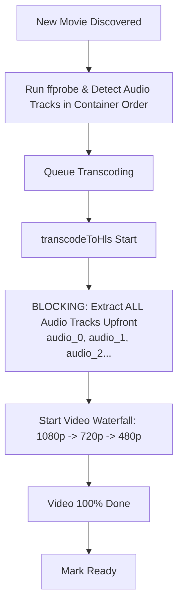
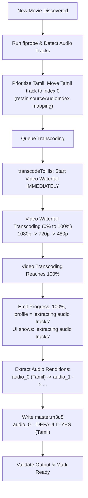

# Architecture & Implementation Plan: Post-Transcode Audio Extraction & Tamil Track Prioritization

## 1. Executive Summary

### Current Problems
1. **Delayed Playability (Upfront Audio Extraction)**:
   When a new multi-audio movie is detected, `movie-server` currently executes `ensureAudioTrackExtracted` for **all** audio tracks upfront in `transcodeToHls` before any video transcoding begins (`src/services/ffmpegService.ts:357-383`). For movies with 3–5 audio tracks (e.g. DTS/AC3 5.1), extracting every track takes several minutes before the first video frame is even touched. This delays video transcoding start time and delays when the first resolution profile becomes playable.
2. **Arbitrary Default Audio Track Index**:
   Audio tracks currently preserve the source container stream order (`0:a:0`, `0:a:1`, etc.). For multi-language Indian releases (e.g., Tamil, Telugu, Hindi, Malayalam, English), English or Hindi is frequently at stream index 0, forcing Tamil-speaking users to manually change the audio track on every playback session.

### The Objectives
1. **Zero-Delay Video Transcoding**: Transcoding of video profiles (2160p / 1080p / 720p / 480p) begins immediately upon queue pickup.
2. **Post-Transcode Audio Extraction**: Extracting HLS audio renditions is deferred until video transcoding reaches 100%.
3. **Transparent UI Status**: While audio tracks are being extracted after 100% video transcoding, the UI explicitly displays **`"extracting audio tracks"`** across the Web App (cards, modal, transcoding drawer) and Android TV.
4. **Tamil Track as Index 0**: Audio tracks named or tagged as `"Tamil"` are automatically placed at index 0 (`audio_0`) with `DEFAULT=YES` in the HLS master playlist, ensuring immediate default playback in Tamil.

---

## 2. High-Level Workflow Comparison

### Current Workflow (Audio First)


### Proposed Workflow (Video First -> Extract Audio Tracks -> Tamil Index 0)


---

## 3. Deep-Dive Design: Audio Track Prioritization (Tamil = Index 0)

### 3.1 Tamil Detection Logic
In `src/services/ffmpegService.ts` (`getMediaInfo`), when analyzing audio streams returned by `ffprobe`:
- Match language codes: `tam`, `ta`, `tamil` (case-insensitive) in `s.tags?.language` or `s.tags?.LANGUAGE`.
- Match stream titles: `s.tags?.title` containing `'tamil'` (case-insensitive, e.g. `"Tamil [Original]"`, `"Tamil 5.1"`).
- Match resolved labels: `label.toLowerCase().includes('tamil')`.

```typescript
function isTamilTrack(track: AudioTrackInfo): boolean {
  const lang = (track.language || '').trim().toLowerCase();
  const label = (track.label || '').trim().toLowerCase();
  return lang === 'tam' || lang === 'ta' || lang === 'tamil' || label.includes('tamil');
}
```

### 3.2 Preserving Source Audio Stream Mapping
> [!IMPORTANT]
> If the Tamil track was stream `0:a:2` in the source file, moving it to array index `0` (`audio_0`) means FFmpeg must extract from `0:a:2`, NOT `0:a:0`!
> We must explicitly record the source stream index in `AudioTrackInfo`.

Update `AudioTrackInfo` in [src/types/movie.ts](file:///c:/Users/KARTHICK%20SG/non_share/movies/movie-server/src/types/movie.ts):
```typescript
export interface AudioTrackInfo {
  /** FFmpeg stream index in the source container (e.g. 1, 2) */
  streamIndex: number;
  /** 0-based audio stream index among all audio streams (e.g. 0:a:0 -> 0, 0:a:1 -> 1) */
  sourceAudioIndex: number;
  /** ISO 639-2 language code, e.g. 'eng', 'tam', 'hin' */
  language: string;
  /** Human-readable display label, e.g. 'Tamil (Stereo)' */
  label: string;
  /** Audio codec, e.g. 'aac', 'ac3', 'dts' */
  codec: string;
  /** Number of audio channels (e.g. 2, 6) */
  channels: number;
}
```

### 3.3 Stable Partitioning / Sorting
When constructing `audioTracks`:
1. Find all tracks matching `isTamilTrack`.
2. If multiple Tamil tracks exist (e.g., 5.1 and Stereo), sort them by channels descending (5.1 first).
3. Place Tamil tracks at the beginning (index 0, 1...).
4. Append all non-Tamil tracks preserving their original relative order.
5. If no Tamil track is found, keep the original stream order.

### 3.4 Updated FFmpeg Audio Extraction Mapping
In [src/services/audioExtractionService.ts](file:///c:/Users/KARTHICK%20SG/non_share/movies/movie-server/src/services/audioExtractionService.ts):
Update `ensureAudioTrackExtracted`:
```typescript
export async function ensureAudioTrackExtracted(
  movieId: string,
  sourcePath: string,
  targetTrackIndex: number,  // 0, 1, 2 -> destination folder audio_0, audio_1...
  sourceAudioIndex: number,  // maps to 0:a:${sourceAudioIndex}
  hlsDirectory: string,
  ffmpegPath: string,
  segmentDuration = 6,
): Promise<void> { ... }
```
FFmpeg spawn arguments will use:
```typescript
'-map', `0:a:${sourceAudioIndex}`,
```
Writing into:
```typescript
path.join(hlsDirectory, movieId, `audio_${targetTrackIndex}`)
```
This guarantees:
- `audio_0` = Tamil audio rendition.
- In `master.m3u8`, `URI="audio_0/playlist.m3u8"` is `DEFAULT=YES,AUTOSELECT=YES`, `NAME="Tamil (5.1)"`.

---

## 4. Deep-Dive Design: Deferring Audio Extraction & UI Status

### 4.1 Sequence in `transcodeToHls` ([src/services/ffmpegService.ts](file:///c:/Users/KARTHICK%20SG/non_share/movies/movie-server/src/services/ffmpegService.ts))

1. **Remove Upfront Audio Extraction**:
   Delete or bypass the blocking `Promise.all(sourceInfo.audioTracks.map(...ensureAudioTrackExtracted...))` at lines 357–383 before the video transcode waterfall.

2. **Run Video Transcoding Waterfall (0% → 100%)**:
   - Chunk workers encode video profiles (`1080p`, `720p`, `480p`) with `-an` (for multi-audio) or muxed AAC (for single-audio).
   - Progress increments normally up to 100%:
     ```typescript
     // When all profiles finish video transcoding:
     profileProgressMap[profile.name] = 100;
     updateOverallProgress(); // Reaches 100%
     ```

3. **Phase Transition: "Extracting Audio Tracks"**:
   Once all video profiles in `toTranscode` have finished encoding:
   ```typescript
   if (sourceInfo.audioTracks.length > 1) {
     logger.info(`Video transcoding complete for ${movieId} (100%). Starting audio extraction...`);
     
     // Signal to UI that audio extraction is now in progress
     if (onProgress) {
       onProgress(100, 'extracting audio tracks');
     }

     let sourceExists = true;
     try {
       await fs.access(inputPath);
     } catch {
       sourceExists = false;
     }

     if (sourceExists) {
       // Extract all audio tracks in parallel or controlled pool
       await Promise.all(
         sourceInfo.audioTracks.map((track, targetIndex) =>
           ensureAudioTrackExtracted(
             movieId,
             inputPath,
             targetIndex,
             track.sourceAudioIndex ?? targetIndex,
             hlsDirectory,
             ffmpegPath,
             segmentDuration,
           ).catch((err: unknown) => {
             logger.warn(`Audio track ${targetIndex} (${track.label}) extraction failed: ${err}`);
           }),
         ),
       );
     }
   }
   ```

4. **Final Master Playlist & Ready Status**:
   - Call `writeMasterPlaylist(finalDir, completedProfiles, sourceInfo.audioTracks)`.
   - `writeMasterPlaylist` verifies `isPlaylistComplete` on each `audio_i/playlist.m3u8` and writes the finalized `master.m3u8` with `DEFAULT=YES` on `audio_0` (Tamil).
   - Complete `metadata.json`.
   - In `movieWatcher.ts` / `server.ts`, mark movie status as `'ready'`, clearing `transcodingProgress` and `transcodingProfile`.

---

## 5. UI Updates Across Clients

### 5.1 State Protocol
When audio extraction begins, the backend updates the movie record in `registry`:
- `status`: `'processing'` or `'partial'`
- `transcodingProgress`: `100`
- `transcodingProfile`: `'extracting audio tracks'`

The Server-Sent Events (SSE) stream (`GET /videos/events`) broadcasts this update in real time.

### 5.2 Web Application (`apps/web`)

1. **Movie Card (`apps/web/src/components/MovieCard.tsx`)**:
   In `statusLabel`:
   ```typescript
   const isExtractingAudio =
     movie.transcodingProfile === 'extracting audio tracks' ||
     (movie.transcodingProgress === 100 && movie.status !== 'ready');

   if (isExtractingAudio) {
     return { text: 'Extracting audio tracks', className: 'tag-processing' };
   }
   ```

2. **Transcoding Queue Drawer (`apps/web/src/components/TranscodingQueueDrawer.tsx`)**:
   - Update `activeMovie` selector so a movie in `'extracting audio tracks'` remains in the "Now Processing" section rather than prematurely being counted as completed:
     ```typescript
     const activeMovie = movies.find(
       (m) => m.status === 'processing' ||
              (m.status === 'partial' && (m.transcodingProgress ?? 0) < 100) ||
              m.transcodingProfile === 'extracting audio tracks'
     );
     ```
   - In Active Task Details:
     - Show: `Combined Multi-Thread Progress: 100%`
     - Active Workers Badge: `"extracting audio tracks"` (with a pulsing audio icon or cyan highlight).

3. **Movie Detail Modal (`apps/web/src/components/MovieDetailModal.tsx`)**:
   - Status display:
     ```typescript
     movie.transcodingProfile === 'extracting audio tracks'
       ? (
         <span className="detail-status-line detail-status-processing">
           <Cpu size={16} className="spin" /> Extracting audio tracks...
         </span>
       )
     ```

### 5.3 Android TV Application (`apps/android-tv`)
In `apps/android-tv/app/src/main/java/com/movieserver/tv/ui/browse/MovieCardPresenter.kt`:
```kotlin
"processing", "partial" -> {
    val profile = movie.transcodingProfile ?: ""
    if (profile == "extracting audio tracks") {
        holder.status.text = "🎵 Extracting audio tracks"
        holder.status.setTextColor(0xFF00E5FF.toInt())
    } else {
        val progress = movie.transcodingProgress?.toInt() ?: 0
        holder.status.text = "⚙ $profile $progress%"
        holder.status.setTextColor(0xFF2196F3.toInt())
    }
}
```

---

## 6. Edge Cases & Resilience

| Scenario | Risk | Mitigation |
| :--- | :--- | :--- |
| **Movie has only 1 audio track (single audio)** | Video chunks mux audio directly into `.ts` | Single audio bypasses separate audio extraction entirely. Video transcode finishes at 100% and immediately transitions to `ready`. |
| **Movie has no Tamil track** | What should index 0 be? | If no Tamil track is found, the original stream order is preserved. Index 0 is the default track in the source file. |
| **Movie has multiple Tamil tracks (5.1 & 2.0)** | Ambiguity on which track is primary | Sort Tamil tracks with highest channel count first (5.1 -> Stereo), so the highest fidelity Tamil track is index 0. |
| **Playback requested before 100% (partial playback)** | Multi-audio fMP4 video variants are video-only; if audio isn't extracted, playback could be silent | `videoRoutes.ts` already features dynamic on-demand extraction for `master.m3u8` and `audio_*`. It shares the same deduplicated `activeAudioJobs` Map. If played during waterfall, on-demand extraction pulls `audio_0` (Tamil) on request. |
| **Server restart during audio extraction** | Truncated `audio_i/playlist.m3u8` left on disk | `repairIncompleteAudioRenditions` runs on server boot, verifies `#EXT-X-ENDLIST`, and re-extracts missing/truncated tracks using the Tamil-first order from `metadata.json`. |
| **Special characters in track titles** | HLS `#EXT-X-MEDIA` format parsing errors | Track labels are sanitized: double quotes escaped to single quotes (`label.replace(/"/g, "'")`). |

---

## 7. Step-by-Step Implementation Roadmap

### Phase 1: Models & Probe Layer
- [ ] Extend `AudioTrackInfo` with `sourceAudioIndex: number` in [src/types/movie.ts](file:///c:/Users/KARTHICK%20SG/non_share/movies/movie-server/src/types/movie.ts).
- [ ] Update `getMediaInfo` in [src/services/ffmpegService.ts](file:///c:/Users/KARTHICK%20SG/non_share/movies/movie-server/src/services/ffmpegService.ts):
  - Record `sourceAudioIndex` for each stream.
  - Implement Tamil detection (`isTamilTrack`).
  - Partition `audioTracks` array with Tamil at index 0.
- [ ] Add unit tests in `tests/qualityProfiles.test.ts` or new `tests/audioTracks.test.ts` validating:
  - Tamil track is shifted to index 0.
  - Non-Tamil tracks keep relative order.
  - `sourceAudioIndex` accurately points back to the source stream index.

### Phase 2: Audio Extraction Service
- [ ] Update `ensureAudioTrackExtracted` in [src/services/audioExtractionService.ts](file:///c:/Users/KARTHICK%20SG/non_share/movies/movie-server/src/services/audioExtractionService.ts) to accept `targetTrackIndex` and `sourceAudioIndex`.
- [ ] Update `repairIncompleteAudioRenditions` to pass `track.sourceAudioIndex`.
- [ ] Update on-demand extraction in [src/routes/videoRoutes.ts](file:///c:/Users/KARTHICK%20SG/non_share/movies/movie-server/src/routes/videoRoutes.ts) to use `track.sourceAudioIndex`.

### Phase 3: Transcoding Pipeline Sequencing
- [ ] In [src/services/ffmpegService.ts](file:///c:/Users/KARTHICK%20SG/non_share/movies/movie-server/src/services/ffmpegService.ts):
  - Remove upfront audio extraction before video profile loop.
  - After `toTranscode` loop completes (100% progress reached), trigger `onProgress(100, 'extracting audio tracks')`.
  - Execute `ensureAudioTrackExtracted` for all `audioTracks`.
  - Call `writeMasterPlaylist`.

### Phase 4: UI Updates
- [ ] Update [apps/web/src/components/MovieCard.tsx](file:///c:/Users/KARTHICK%20SG/non_share/movies/movie-server/apps/web/src/components/MovieCard.tsx) to display `"Extracting audio tracks"` tag when `transcodingProfile === 'extracting audio tracks'`.
- [ ] Update [apps/web/src/components/TranscodingQueueDrawer.tsx](file:///c:/Users/KARTHICK%20SG/non_share/movies/movie-server/apps/web/src/components/TranscodingQueueDrawer.tsx) to keep active card during audio extraction and display badge.
- [ ] Update [apps/web/src/components/MovieDetailModal.tsx](file:///c:/Users/KARTHICK%20SG/non_share/movies/movie-server/apps/web/src/components/MovieDetailModal.tsx) to show `"Extracting audio tracks..."`.
- [ ] Update [apps/android-tv/app/src/main/java/com/movieserver/tv/ui/browse/MovieCardPresenter.kt](file:///c:/Users/KARTHICK%20SG/non_share/movies/movie-server/apps/android-tv/app/src/main/java/com/movieserver/tv/ui/browse/MovieCardPresenter.kt) for Android TV status.

### Phase 5: Verification & End-to-End Testing
- [ ] Test with multi-audio MKV containing English (stream 0) and Tamil (stream 1).
- [ ] Verify video chunk transcoding starts immediately with no upfront audio delay.
- [ ] Verify SSE stream emits `{ transcodingProgress: 100, transcodingProfile: 'extracting audio tracks' }`.
- [ ] Verify Web UI shows `"extracting audio tracks"` in card, drawer, and modal.
- [ ] Verify generated `master.m3u8` has Tamil at `audio_0` with `DEFAULT=YES`.
- [ ] Verify playback in browser and VLC starts with Tamil audio by default.
