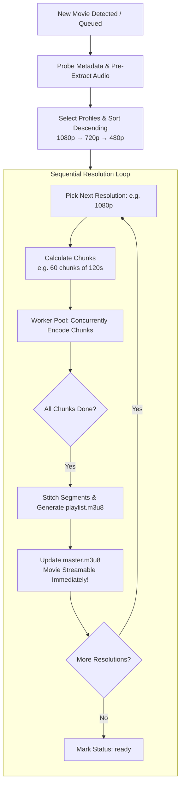

# Architecture & Execution Plan: Fast Multi-Threaded Chunk-Based Transcoding

## 1. Executive Summary

### The Challenge Today
Currently, `movie-server` transcodes all target resolutions (e.g., `1080p`, `720p`, `480p`) simultaneously. Each resolution runs a single FFmpeg process processing the entire 2-hour movie from start to finish ($0 \to \text{duration}$).

This has three critical drawbacks:
1. **CPU & I/O Contention**: 3–4 FFmpeg processes compete for CPU cycles and disk bandwidth at the same time.
2. **Delayed Time-to-Streamable (TTS)**: The highest resolution (`1080p`) takes 30–60+ minutes before a single frame is streamable.
3. **Fragile Crash Recovery**: An interruption at 95% of a 2-hour file requires re-encoding the entire movie for that profile.

### The Proposed Strategy
Transform the transcoding pipeline into a **Resolution Waterfall with Chunk-Based Parallelism**:
1. **Focus 100% of CPU on Highest Resolution First** (`1080p` or `2160p`).
2. **Split the Movie into Time Chunks**: Divide the timeline into discrete slices (e.g., 120-second chunks).
3. **Transcode Chunks Concurrently across Threads**: A pool of Node Worker Threads executes FFmpeg on individual chunks in parallel, saturating all CPU cores efficiently.
4. **Integrate / Stitch Chunks**: As soon as all chunks for the resolution complete, assemble them into the final HLS playlist and publish `master.m3u8`.
5. **Immediate Playability**: The movie immediately enters the `'partial'` state and becomes streamable at maximum quality in a fraction of the original wait time (~5–8 minutes instead of ~45 minutes).
6. **Cascade to Next Resolution**: Proceed sequentially to `720p`, then `480p`, updating `master.m3u8` at each stage until all profiles are complete (`'ready'`).

---

## 2. High-Level Workflow & Architecture



---

## 3. Deep-Dive: The 5-Phase Pipeline

### Phase 1: Probing & Fast Audio Decoupling
Video encoding consumes ~98% of CPU compute; audio encoding consumes < 2% and runs at 100x–200x real-time.
- **Pre-extract Audio Upfront**: Extract and transcode all audio tracks across the entire movie into standard HLS audio renditions (`audio_0/`, `audio_1/`) in **15–30 seconds**.
- **Video-Only Chunks (`-an`)**: By decoupling audio, video chunk workers only process video frames. This completely eliminates:
  - Audio boundary clicks / pops (zero-crossing phase issues).
  - Audio/video drift at chunk stitch points.
  - AAC packet sample boundary misalignments (1024-sample frame boundaries).

### Phase 2: Chunk Partitioning & Keyframe Alignment
- **Segment-Aligned Boundaries**: 
  - Standard HLS segment duration $S = 6\text{s}$.
  - Chunk duration $C$ must be an integer multiple of $S$ (recommended: $C = 120\text{s} = 20 \times 6\text{s}$ segments).
  - For total duration $T$, total chunks $N = \lceil T / C \rceil$.
- **Chunk Geometry**:
  $$\text{Chunk } k \text{ covers } [\text{start}_k, \text{end}_k) \quad \text{where } \text{start}_k = k \times C, \; \text{end}_k = \min((k + 1) \times C, T)$$
  $$\text{Starting Segment Index } \sigma_k = \frac{\text{start}_k}{S}$$

### Phase 3: Parallel Chunk Execution (Worker Pool)
- **Worker Concurrency Limit**: 
  $W = \min(\text{CPU Cores}, \text{CONFIG.MAX\_CHUNK\_WORKERS})$ (e.g. 4–6 workers).
- **Accurate & Fast FFmpeg Seeking**:
  ```bash
  ffmpeg -y \
    -ss {start_k} \
    -t {chunk_duration} \
    -accurate_seek \
    -i {inputPath} \
    -map 0:v:0 -an \
    -c:v libx264 -preset veryfast -crf 23 \
    -maxrate {videoBitrate} -bufsize {2x videoBitrate} \
    -vf {scaleFilter} \
    -force_key_frames "expr:gte(t,n_forced*6)" \
    -sc_threshold 0 \
    -threads {threads_per_worker} \
    ...
  ```
- **Segment Output Strategy Options**:
  - **Option A: Direct Segment Output with `-start_number` (Zero Remux Overhead)**
    - FFmpeg outputs directly to HLS segments:
      `-f hls -hls_time 6 -hls_segment_type {ts|fmp4} -start_number {sigma_k} -hls_segment_filename segment_%04d.ts -output_ts_offset {start_k}`
    - Each chunk writes non-overlapping segment files: Chunk 0 writes `segment_0000.ts`–`segment_0019.ts`, Chunk 1 writes `segment_0020.ts`–`segment_0039.ts`.
    - **Stitching is instantaneous**: The orchestrator merely aggregates segment metadata into `playlist.m3u8` in milliseconds without touching media bytes!
  - **Option B: Chunk to Intermediate `.ts`/`.m4s` + FFmpeg Concat Remux**
    - Each worker generates a single chunk file: `chunk_000.ts`, `chunk_001.ts`.
    - An instant `ffmpeg -f concat -c copy -f hls ...` runs at disk I/O speeds (2–3 seconds for 2 hours) to build the finalized playlist and segments.

> [!TIP]
> **Recommendation**: **Option A** with `-output_ts_offset` is the fastest because it eliminates intermediate disk writes. If container timestamp continuity for certain edge-case input containers proves sensitive, **Option B** serves as a bulletproof fallback.

### Phase 4: Integration / Stitching & Immediate Publication
Once worker pool completes chunk $0 \dots N-1$ for resolution $R$:
1. **Manifest Generation**: Build the final `$R$/playlist.m3u8` containing all segments from 0 to $N_{\text{total}}-1$ with `#EXT-X-ENDLIST`.
2. **Master Manifest Update**: Add resolution $R$ into `master.m3u8`.
3. **Registry State Transition**:
   - Status switches from `'processing'` to `'partial'`.
   - Movie `/play` endpoint immediately returns `302 Found` pointing to `master.m3u8`.
   - **Users can start watching in crystal-clear 1080p right now!**
4. **Intermediate Cleanup**: Clean up any chunk temp metadata/logs.

### Phase 5: Waterfall Cascade to Next Resolution
- Proceed to resolution $R-1$ (e.g. `720p`).
- Re-run the parallel chunk pool with 720p parameters.
- Finalize `720p/playlist.m3u8` and update `master.m3u8`.
- Repeat for `480p`.
- Once the lowest profile finishes:
  - Write `metadata.json`.
  - Update status to `'ready'`.

---

## 4. Concurrency & Performance Sizing

| Metric | Current Monolithic Transcoding | Proposed Waterfall Chunk Transcoding |
|---|---|---|
| **CPU Saturation** | Sublinear (1 process per profile has diminishing returns > 4–6 threads) | High (4–6 chunk processes running concurrently fully saturate all physical cores) |
| **Time-to-First-Playable (1080p)** | ~40–60 mins (contending with 720p and 480p) | **~6–10 mins** (100% of CPU dedicated to 1080p chunks) |
| **Crash Recovery** | Restarts whole profile if interrupted | Resumes from the last completed chunk |
| **Memory Footprint** | Low (3 full streams) | Predictable: $W \times \text{Worker RAM}$ (~$W \times 300\text{MB}$) |

### Recommended Sizing Configuration:
- `HLS_SEGMENT_DURATION`: `6` seconds (existing standard).
- `TRANSCODE_CHUNK_DURATION`: `120` seconds (20 segments per chunk).
- `TRANSCODE_CHUNK_WORKERS`:
  $$\max(1, \min(\lfloor \text{os.cpus().length} / 2 \rfloor, 6))$$
  *(e.g., 4 workers on an 8-core CPU, each worker running FFmpeg with `-threads 2`)*.

---

## 5. Crash Recovery & Resumption Strategy

Under the current architecture, if the server restarts while 1080p is at 90%, the entire profile is lost.
Under the Chunk Architecture:
1. Each chunk output or chunk completion status is tracked (e.g., presence of complete segments or a lightweight `.chunk_done` manifest).
2. On server restart / resume:
   - Identify which chunks $0 \dots N-1$ already have verified outputs.
   - Dispatch *only the missing chunks* to the worker queue.
   - If only 3 out of 60 chunks were remaining, 1080p completes in under 30 seconds upon restart!

---

## 6. Implementation Architecture Plan

### New & Modified Modules
1. **`src/services/transcodeChunkPlanner.ts`** (New):
   - Computes chunk split points, start/end timestamps, start segment indices, and segment alignment.
2. **`src/services/transcodeChunkWorker.ts`** (Enhanced / Replaced `transcodeWorker.ts`):
   - Worker thread receiving `{ inputPath, outputDir, profile, chunkIndex, startSec, duration, startSegmentNumber }`.
   - Runs FFmpeg for that exact slice and posts progress back to the orchestrator.
3. **`src/services/chunkStitcher.ts`** (New):
   - Validates all chunk segments, concatenates or writes the final `playlist.m3u8`, verifies `#EXT-X-ENDLIST`.
4. **`src/services/ffmpegService.ts`** (Updated `transcodeToHls`):
   - Refactored from `toTranscode.map(...)` (parallel profiles) to a sequential loop over profiles.
   - For each profile: launches chunk worker pool, monitors progress, calls `chunkStitcher`, updates `master.m3u8`, notifies listeners.
5. **`src/config/env.ts`**:
   - Add `transcodeChunkWorkers` and `transcodeChunkDurationSeconds`.

---

## 7. Phased Implementation Roadmap

- [ ] **Phase 1: Chunk Planner & Slice Math**: Create unit-tested chunk calculation utility with exact segment boundary alignment.
- [ ] **Phase 2: Chunk Worker & Seeking Verification**: Implement chunk encoding worker with fast/accurate seeking and test timestamp continuity with ffprobe.
- [ ] **Phase 3: Chunk Stitcher & Playlist Generation**: Implement direct segment indexing and manifest assembly.
- [ ] **Phase 4: Waterfall Orchestration in `ffmpegService.ts`**: Wire the sequential resolution loop with live progress aggregation.
- [ ] **Phase 5: Resumption & Edge Cases**: Add chunk-level crash recovery and test with variable frame rate (VFR) and multi-audio sources.
